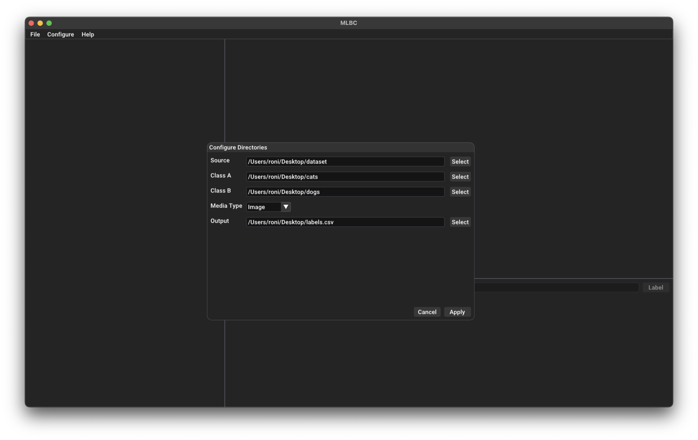
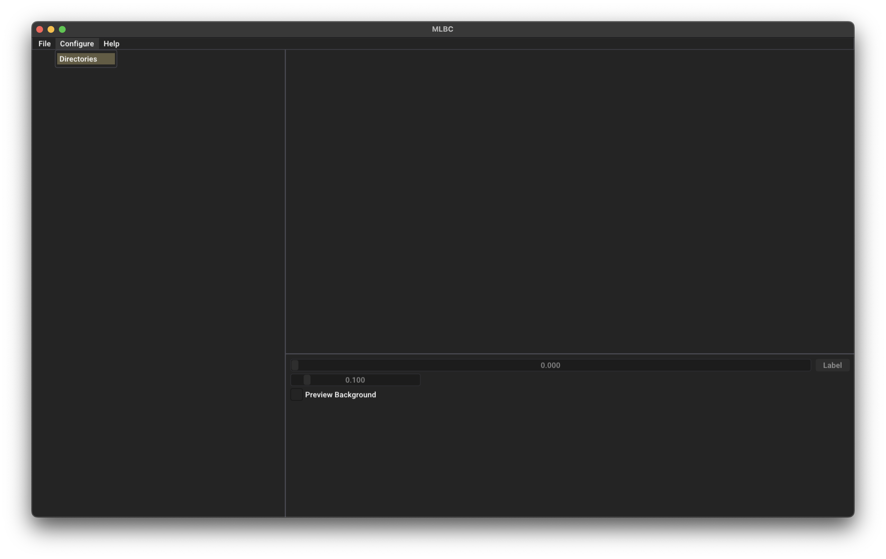

# MLBC: Media Labeller for Binary Classification

MLBC simplifies the process of labeling large datasets, such as images, for binary classification tasks. It offers fast previews, intuitive confidence scoring (indicating the likelihood that an image belongs to one class over another), and automated record keeping in CSV format. MLBC is highly adaptable, allowing for seamless adjustments to your labeling workflow.

## Build (macOS)

1. Make sure [Homebrew](https://brew.sh/) is installed on your system.
2. Clone the repository. (`git clone --recursive https://github.com/roniabusayeed/mlbc.git`)

3. Navigate to the project root directory (e.g., .../mlbc/) and run the following commands.
    1. `./configure.sh`
    2. `./build.sh`

    The executable will be located in the `build` directory within your project root.

## Install (macOS)
Navigate to the project root directory (e.g., .../mlbc/) and run `./install.sh`.

`mlbc` is now installed on your system. You can now run `mlbc` by simply entering `mlbc` on your terminal and hitting the `Return`/`Enter` Key.

## Keybord Shortcuts
- **Adjust Confidence Slider** Use A and D keys to decrease and increase the primary slider value, respectively. Adjust sensitivity with the secondary sensitivity slider below the primary slider.
- **Label Images** Press L to label an image, which functions identically to clicking the “Label” button.

**Note** Currently, only image files are supported.

## Screenshots
Here are some screenshots of MLBC in action.

