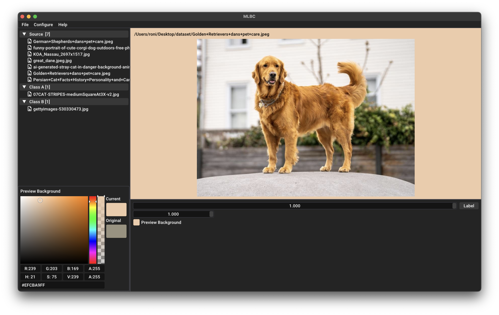

# MLBC: Media Labeller for Binary Classification

MLBC simplifies the process of labeling large datasets, such as images, for binary classification tasks. It offers fast previews, intuitive confidence scoring (indicating the likelihood that an image belongs to one class over another), and automated record keeping in CSV format. MLBC is highly adaptable, allowing for seamless adjustments to your labeling workflow.

## Build (macOS)

1. **Install Homebrew** If not already installed, visit [Homebrew](https://brew.sh/) and follow the installation instructions.
2. **Clone the Repository** Clone the MLBC repository with the following command.
    ```
    git clone --recursive https://github.com/roniabusayeed/mlbc.git`
    ```
    *(Note: The $ symbol represents your terminal prompt and is not part of the command.)*

3. **Build the Project**: Navigate to the project root directory (e.g., .../mlbc/) adn run the following commands.
    
    **Configure**

    ```
    ./configure.sh
    ```
    *(This command needs to be run only once, even for multiple builds.)*

    **Build**
    ```
    ./build.sh
    ```
    *(The executable will be located in teh `build` directory within your project root.)*

## Install (macOS)
After building the project, install the applicaiton by running from your project root directory:
```
./install.sh
```
Now that `mlbc` is installed on your system, you can run it from the terminal using:
```
mlbc
```

## Keybord Shortcuts
- **Adjust Confidence Slider** Use A and D keys to decrease and increase the primary slider value, respectively. Adjust sensitivity with the secondary sensitivity slider below the primary slider.
- **Label Images** Press L to label an image, which functions identically to clicking the “Label” button.

**Note** Currently, only image files are supported.

## Screenshots
Here are some screenshots of MLBC in action.


